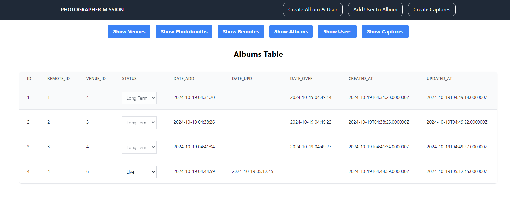

## Photographer-Admin

This was created for testing purposes only.

This was designed to have an easy access to the inner workings of the backend.

In here, you can create new users, add a user to specific user album, and the most important thing, add photos to each users.

This will not be accessible to common users.

